# Avatar Extensions

This page is for organizing all important ideas about Avatar Extension in one place.

[Reading Sequence of papers](https://github.com/advancedresearch/path_semantics/blob/master/sequences.md#avatar-extensions)

### Avatar Logic

For an experimental implementation, see [Avalog](https://github.com/advancedresearch/avalog).

Avatar Logic replaces predicates with binary relations with some additional axioms (written as an [Avatar Table](https://github.com/advancedresearch/path_semantics/blob/master/papers-wip2/avatar-tables.pdf)):

```text
p(a, b)         b : p           p(a) = b
p(a, q'(b))     q'(b) : p       p(a) = {q'(_)} ∈ q'(b)
```

Translated to [Zermelo-Fraenkel Set Theory](https://en.wikipedia.org/wiki/Zermelo%E2%80%93Fraenkel_set_theory) (see [paper](https://github.com/advancedresearch/path_semantics/blob/master/papers-wip2/avatar-logic-to-set-theory.pdf)):

```text
(a, b) ∧ b : p ∧ uniq(b)
---------------------------------------------------------
(p, (a, b)) ∧ ∃! z { (p, (a, z)) } ∧ ∃! r { (r, (a, b)) }

(a, q'(b)) ∧ q'(b) : p
--------------------------------------------------------------------------------
(p, (a, (q, b))) ∧ ∀ x { ∃! z { (p, (a, (z, x))) } } ∧ ∃! r { (r, (a, (q, b))) }
```

This means that `(a, b)` contains all information needed to represent a labeled edge.

```text
b : p             `b` has the role `p`
q'(b)             the `q` 1-avatar of `b`
p(a) = q'(b)      the `p` property of `a` is `q'(b)`
p(a) => q'(b)     the `p` property of `a` has `q'(b)`
.q'(b) = b        the inner operator is a `.` in front of an expression
uniq q            make the `q` 1-avatar behave uniquely
```

### Avatar Algebra

Avatar Algebra relates theorems in algebra to theorems about Avatar Extensions.

```
*     introduction operator
1     the natural 1-avatar
0     the contracting 1-avatar
-     negation is an involution that covers symmetries in products
+     symmetry operator
```

Theorems:

```
a * 1 = 1 * a = a                       introduction of new 1-avatar
-(a * b) = (-a) * b = a * (-b)          coverage of products using 1->1 avatar involutions
(a + b) * f(x) = a * f(x) + b * f(x)    superposition of mathematical objects related to 1-avatar symmetry
(a * b) * c = a * (b * c)               associativity is a 6-avatar of a 9-vertex filled avatar graph
a + b = b + a                           symmetry between 1-avatars
```

### Avatar Graphs

Avatar Graphs might be thought of as discrete topological qualities of manifolds.

For visualization, see [Avatar-Graph](https://github.com/advancedresearch/avatar_graph).

The "core self" is an object which has no internal relations for introspection.
Avatars are created to model relations.

- A 1-avatar is directly communicating with the core, but can not communicate with each other
- A 2-avatar integrates information between two 1-avatars
- A 3-avatar integrates information between three 1-avatars, or one 2-avatar plus one 1-avatar
- An N-avatar integrates information between a partition of lower avatars

Information must be passed down from higher avatars in the direction of the core.
An Avatar Graph "forgets" which node is the core.

- A black node represents a core candidate
- A white node represents an N-avatar with smallest N greater than zero
- A black edge connects two avatars
- A gray/dashed edge identifies a unique highest N-avatar per core

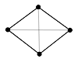
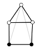
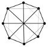
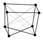
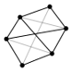
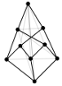

A filled Avatar Graph consists only of core candidates.

- Every hypercube is a filled Avatar Graph
- Wagner graph is a filled Avatar Graph with Möbius topology
- Filled Avatar Graphs are bases for groupoid self-similarity

A reflection witnessed by a product `(x, x)` is impossible to model in an Avatar Graph.
This means that a "copy" of `x` must be constructed, which eventually requires copies of 1-avatars.
Translated into a theorem about Avatar Extensions, this means 1->1 avatars "covers" products.

### Avatar Semantics

The [core axiom](https://github.com/advancedresearch/path_semantics/blob/master/sequences.md#foundation) of [Path Semantics](https://github.com/advancedresearch/path_semantics) can be naively modeled in Avatar Logic as following:

```
(C, D) :- (A, B), (B, A), (A, C), (B, D).
```

This propagates products from every identity morphism using outgoing arrows.
Adding this axiom to Category Theory collapses a category into a partial groupoid.
It is kind of like extending a square matrix.
Can also be thought of as a compact representation of an equivalence class.

The analogue for isomorphisms (without identity morphisms) constructs the following way:

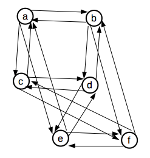
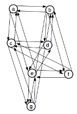
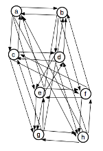

Step 1 is the smallest possible example of a Möbius topology.

In [Path Semantical Logic](https://github.com/advancedresearch/path_semantics/blob/master/sequences.md#path-semantical-logic),
propositions are separated by levels, which gets rid of Möbius topology.
Applying the core axiom to a single level would contract all propositions along implications,
because of reflexivity `x = x` is a tautology.

In the language of graphs, it is possible to avoid contraction in a single level since identity morphisms are not necessary.

The diagonals corresponds to highest N-avatars in hypercubes,
which can be interpreted as the smallest reduction of an inconsistent theory to a consistent theory.

For example, Girard's paradox is avoided in type systems by using cumulative universes or types.
The highest N-avatars in this context are morphisms between type levels, which are just type memberships.
Therefore, Type Theory is essentially a highest N-avatar reduction to make modeling of mathematics consistent.

The diagonals on a cube can be thought of as swap operations,
which generates all permutations by selecting a face + rotation in the plane:

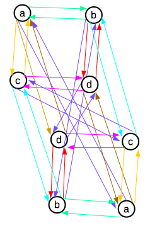

This interpretation is the only one that preserves structure.

Group Theory might be thought of as operations on highest N-avatars satisfying the notion of "resources" in linear logic.

### Avatar Witness Theory

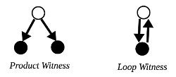

Witness Duality can be thought of as two different models of equivalence.

- Product Witness (`=`) has its origin in the treatment of equivalence as a binary relation
- Loop Witness (`~=`) has its origin in the treatment of equivalence as an identity morphism

Normally, `=` is used for equality and `~=` for existence of isomorphisms,
but for Witness Duality this depends on the interpretation.
However, the Product Witness can not distinguish between multiple isomorphisms,
while the Loop Witness can not express the global constraint of an equivalence relation.

The analogue of the Univalence Axiom says that Witness Duality can only be witnessed with a Loop Witness:

```text
(A = B) ~= (A ~= B)
```

Symmetry Forcing, a property where proofs of reflexivity requires an isomorphic reconstruction,
is related to the Product Witness.

There are two consistent type theories that interprets [Path Semantical Logic](https://github.com/advancedresearch/path_semantics/blob/master/sequences.md#path-semantical-logic):

- Curry-Horward Correspondence, `a : A <=> A(a)`
- Arbitrary equivalences between programs with equality types as existence proofs, `a : A <=> a(A)`

These two theories are cocategory of each other, where morphisms are type memberships.

The first theory satisfies univalence, while the second does not.
However, by applying avatar extensions using univalence, one can unify these two theories,
by introducing a "special type membership" for which univalence holds,
as a kind of proof of transitivity.

An example is Cubical Type Theory, where this special type membership is parameterised by the unit interval.
The end points of the unit interval are `0` and `1`.

Avatar Univalence might be represented as an L-system:

```
/ ~~                The core axiom of Path Semantics
~ ~~                Homotopy
/ /~                Inside univalence
~ /~                Outside univalence

/~ => / ~~ ~ ~~     Inserting the core axiom (termination)
/~ => / /~ ~ /~     Inserting inside and outside univalence (higher dimensional continuation)
```

In the [formalisation of Path Semantical Intuitionistic Propositional Logic (PSI) in Avatar Logic](https://github.com/advancedresearch/avalog/blob/master/source/psi.txt):

- The Product Witness is turned on by default (`x = x` can be derived from `x = y`)
- The Loop Witness can be turned on using `uniq eq` (`x = x` must be assumed explicitly)

PSI uses a notion of equality that is non-reflexive, that is, `x = x` is not a tautology.

#### Interior vs Exterior

The Interior is constructed using a core with an identity morphism as a "ground state",
getting topological properties via Product Witness (due to Symmetry Forcing).

The Exterior is constructed using a loop onto the identity morphism with a 1-avatar extension as the Loop Witness.
This is related to exterior algebra.

Philosophical argument about self-referential Avatar Extensions as the interior:

1. A theory must have an exterior to be used as "core self"
2. If the exterior of Avatar Extensions is a dual theory, then they are related through an involution
3. Involutions can be extended to Avatar Extensions, hence Avatar Extensions being avatar extendable
4. Avatar Extensions witnesses its own extension, therefore is a Loop Witness
5. The Exterior Avatar Extensions is a Product Witness, therefore, a candidate for the exterior might be Avatar Graphs

### Avatar Modal Subjectivity

Avatar Modal Subjectivity can be thought of as guarded dialetheism as a technique for language boundaries.

The classical notion of subjectivity and objectivity is replaced with a unified concept "modal subjectivity" (e.g. `s`).

```
◇s            non-uniform modal subjectivity = classical subjectivity
□s            uniform modal subjectivity = classical objectivity
□¬s => □s     uniform modal non-subjectivity implies uniform modal subjectivity
```

Uniform modal non-subjectivity `□¬s` might be thought of as classical absolute objectivity,
but this is weakened to uniform modal subjectivity.

Normal axioms:
```
Modal logic:
¬□¬p <=> ◇p
¬◇¬p <=> □p

Propositional logic:
¬¬p <=> p
(p => q) <=> (¬q => ¬p)

Associativity:
(¬□)(¬p) <=> ¬(□¬p)
```

#### Weak Monotonicity

The full experience of an observer in a given moment can never be repeated in practice.
To model this phenomena, one can think of an infinite time counter, forever increasing.
A time counter is monotonic, hence approximations to subjective experiences are thought of as having a *weak monotonicity* property.

- Higher weak monotonicity means the experience has less potential for repetition
- The product of two experiences has an equal or higher weak monotonicity than each individual experience

Relations to Avatar Witness Theory:

- An observer is related to experiences using the Product Witness
- Self referentiality is related to the Loop Witness

For example, witness duality implies that it is impossible to talk about/define objectiveness without self referentiality.

In theories concerning weak monotonicity, the product of uniform and non-uniform subjectivity can be simplified:

```text
□p ∧ ◇p <=> ◇p
```

#### Paradoxes and Tautologies

Some kind of paradoxes are related to Möbius topologies in Avatar Graphs.
These graphs can be transformed into orthogonal mathematical objects using topological surgery.

For example, a Wagner graph can be transformed in a 3-cube graph.

The topological surgery operation is an involution and relates uniformity of paradoxes with non-uniformity of tautologies.

With self referentiality, it is easier to visualize the involution.

For example:

1. "this sentence is false" is known as Liar's paradox
2. "this sentence is true" is a tautology with two solutions

The second sentence is related to the first one using involution on "this sentence is X".

The Liar's paradox offer no potential for non-uniform subjective experience.

Witness duality: In the tautology, an observer can experience one interpretation and later reinterpret it in future experiences,
but it is impossible to reinterpret the original experience.

### Avatar Schema Theory

Inside vs Outside Theories form an underlying structure that integrates Kent Palmer's (Ph.D) [Schema Theory](http://schematheory.net/).

Definition of an Inside Theory:

	An Inside Theory is a mathematical language which models external objects as unknowns

Inside Theory is covered by the core axiom of Path Semantics using strictest order.

Definition of an Outside Theory:

	An Outside Theory is a mathematical language with at least one symbol which does not refer to its theory

A hypothesis is that Outside Theory is related to weakening the order assumption in the core axiom of Path Semantics.

For philosophical argument of Inside vs Outside, see the blog post [Plato's Cave Found in Mathematics](https://advancedresearch.github.io/blog/2021-01-18-platos-cave-found-in-mathematics).

Axioms:

```text
consistency ⊼ completeness
verification ⊼ validation
clarity ⊼ coherence
inside ⊼ outside
	
consistency ∨ completeness ∨ clarity => inside
verification ∨ validation => outside
coherence => inside ∨ outside
```

`⊼` is logical NAND and represents Gödelian pairs.

Definition of Formal and Semantics:

```text
formal := consistency ∨ completeness ∨ clarity
semantics := verification ∨ validation
```

This is sufficient to prove the Gödelian pair:

```
formal ⊼ semantics
```

There are 13 satisfied models of the axioms:

```text
- - - - - - - -    4 x 4: Consistency Verification
- - - - - - - -    2 x 2: Completeness Validation
- - - - - - - O    1 x 1: Clarity Coherence
- - - - - - - O
- - - - - - - O       X Y    ¬X Y
- - - - - - - O     
- - - I - I - ⊻       X¬Y    ¬X¬Y
- - I I I I I ⊥
```

`⊻` is just coherence that is both Inside and Outside.
`⊥` is absence of all properties which is neither Inside or Outside.

Maximum mathematical languages can have at most 2 properties, given by the grammar:

```text
verification|validation coherence
consistency|completeness coherence|clarity
```
